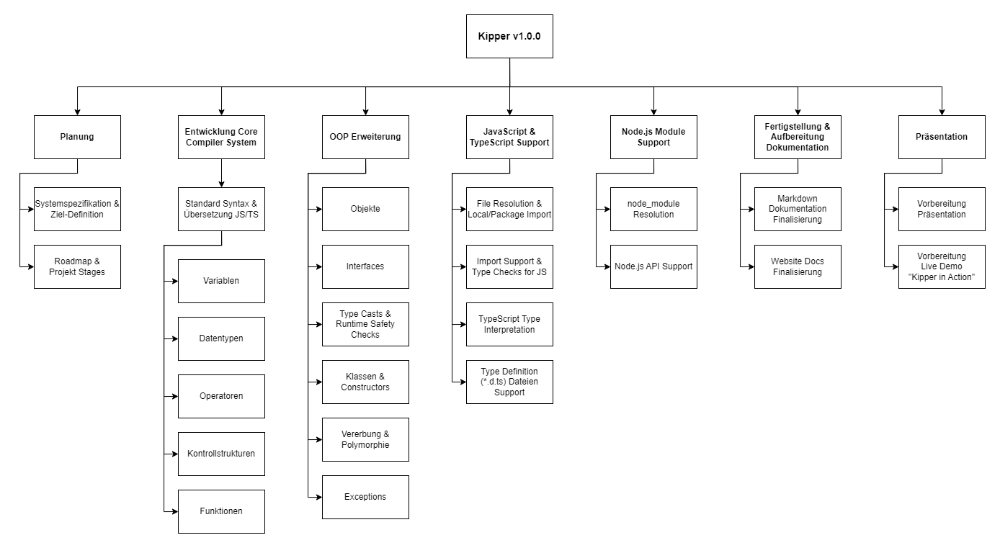

# Projektstrukturplan

## Grafischer Plan

## Table-like Plan

### 1. Planung

- 1.1 Systemspezifikation
- 1.2 Roadmap & Projekt Stages

### 2. Entwicklung Core Compiler System

- 2.1 Standard Syntax und Übersetzung zu JS/TS
  - 2.1.1 Variablen
  - 2.1.2 Datentypen
  - 2.1.3 Operatoren
  - 2.1.4 Kontrollstrukturen (if, while, for)
  - 2.1.5 Funktionen

### 3. OOP Erweiterung

- 4.1 Objekte
- 4.2 Interfaces
- 4.3 Type Casts und Runtime Safety Checks
- 4.4 Klassen und Constructor
- 4.5 Vererbung
- 4.6 Polymorphie
- 4.7 Exceptions

### 4. Support für JavaScript & TypeScript Dateien

- 5.1 File Resolution & Local/Package Import
- 5.2 Import Support & Type Checks for JS
- 5.3 TypeScript Type Interpretation
- 5.4 Type Definition (\*.d.ts) Dateien Support

### 5. Fertigstellung & Aufbereitung Dokumentation

- 6.1 Markdown Dokumentation Finalisierung
- 6.2 Website Docs Finalisierung

### 6. Präsentation

- 7.1 Vorbereitung Präsentation
- 7.2 Vorbereitung Live Demo - "Kipper in Action"
