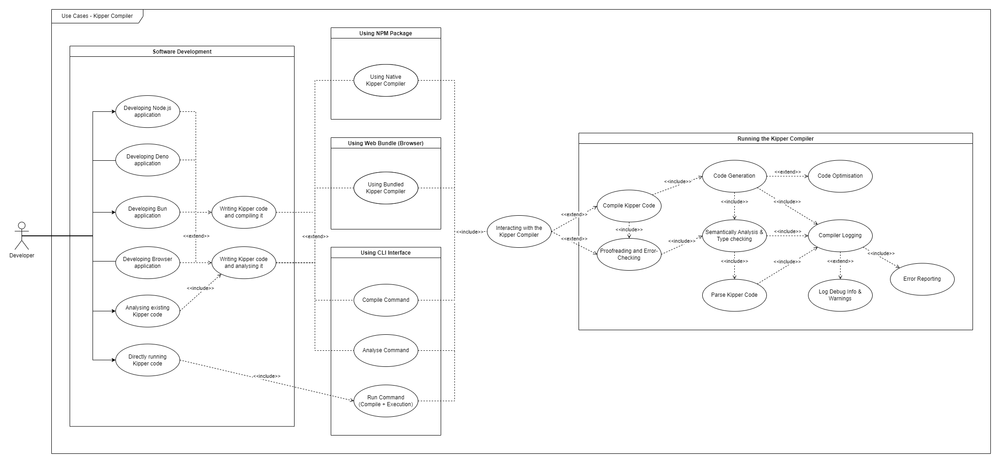
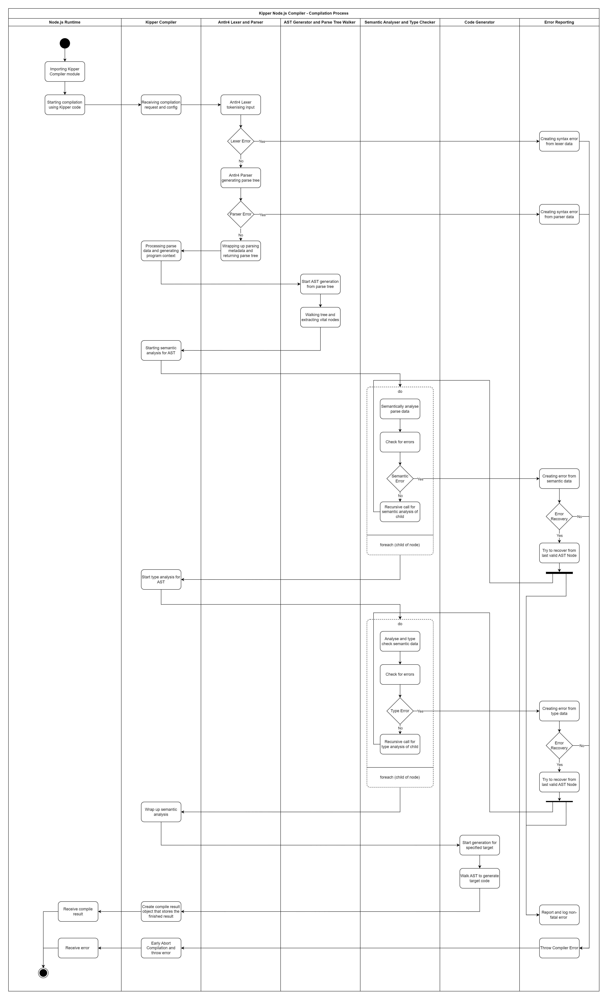
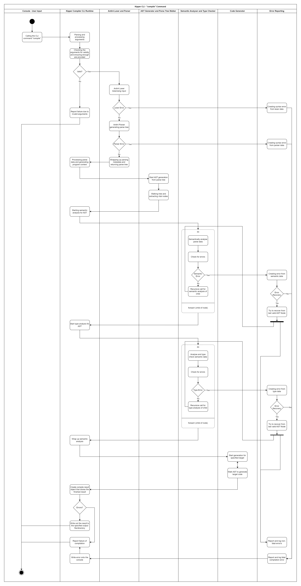
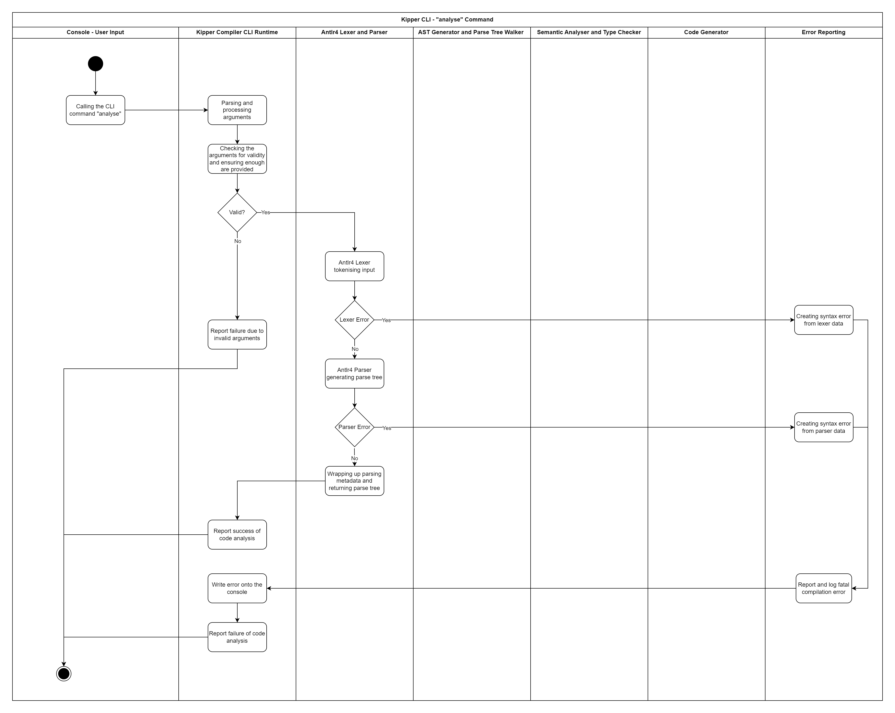
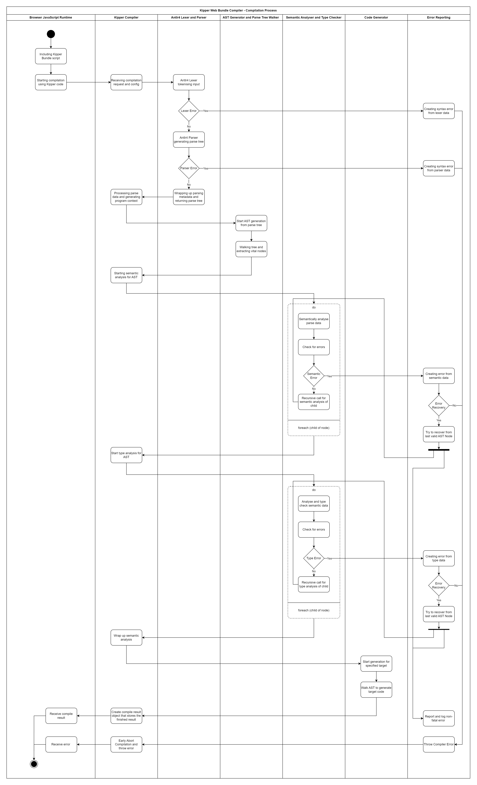

# System-Spezifikation Kipper

## Inhaltsverzeichnis

- [1. Ausgangslage und Zielsetzung](#1-ausgangslage-und-zielsetzung)
  - [1.1 Ist-Situation](#11-ist-situation)
  - [1.2 Verbesserungspotenziale](#12-verbesserungspotenziale)
  - [1.3 Bisherige Umsetzung von Kipper](#13-bisherige-umsetzung-von-kipper)
  - [1.4 Zielsetzung](#14-zielsetzung)
- [2. Funktionale Anforderungen](#2-funktionale-anforderungen)
  - [2.1 Use Case Überblick](#21-use-case-überblick)
  - [2.2 Use Case - Node.js](#22-use-case---nodejs)
  - [2.3 Use Case - CLI](#23-use-case---cli)
  - [2.4 Use Case - Web Bundle](#24-use-case---web-bundle)
- [3. Nicht-funktionale Anforderungen](#3-nicht-funktionale-anforderungen)
- [4. Mengengerüst](#4-mengengerüst)
- [5. Systemarchitektur](#5-systemarchitektur)

## 1. Ausgangslage und Zielsetzung

### 1.1. Ist-Situation

<!-- :bulb: **Hinweise:** -->
<!-- - Hier wird zuerst das Projektumfeld geklärt: Geht es um den Imkerverein oder das Schulbuffet der HTL Leonding? -->
<!-- - Beschreiben Sie die Istsituation: Um welche Aktivitäten/Abläufe handelt es sich? -->

Zurzeit sind im Web-Development Bereich JavaScript sowohl als auch TypeScript die primären Sprachen, welche verwendet
werden, um Webanwendungen zu entwickeln. JavaScript ist seit mehr als 20 Jahren die Standard-Sprache von Browsern und
wird mit dem internationalen Standard ECMA-Script vereinheitlicht, um zu garantieren, dass Scripts in allen Browsern
gleich funktionieren. Diese basiert auf einen Interpreter, welche den Code je Zeile ausführt. TypeScript hingegen
ist eine Erweiterung ("Superset") davon, die zu JavaScript kompiliert/transpiliert, welche es ermöglicht Types zu
definieren und diese mithilfe eines Type-Checkers zu verwenden und zu überprüfen.

Der Type-Checker von TypeScript analysiert während der Kompilierung, ob die spezifizierten Types im Programm korrekt
verwendet werden und gibt bei Fehlern eine Fehlermeldung aus. Dies bietet extra Sicherheit für die Sprache gegenüber
JavaScript, da generelle Probleme schnell erkannt werden können und beschleunigt daher die Entwicklung, da
Entwickler\*innen oft nicht mehr auf Runtime-Fehler warten müssen, um Probleme im Code zu beheben.

Diese Types sind jedoch nur während der Development Phase/Kompilierung verfügbar. Nach der Kompilierung wird der
Code in JavaScript übersetzt und kann somit nicht mehr von der Typisierung profitieren, da das Umfeld strikt
JavaScript-basiert ist und der Compiler keine eigene Verhaltens-verändernde Änderungen hinzufügen darf. Zudem
implementiert TypeScript größtenteils keine eigene Funktionalität (außer Code für Kompatibilität von
unterschiedlichen ECMA-Script Versionen), welche JavaScript nicht bereits bietet, um kompatibel zu bleiben.

### 1.2. Verbesserungspotenziale

<!-- :bulb: **Hinweise:** -->
<!-- - Beschreiben Sie hier die Probleme und Verbesserungspotenziale in bezug auf die Istsituation. -->
<!-- - Es sollte dabei klar werden, dass unbedingt Handlungsbedarf besteht! -->

#### Limitierungen durch JavaScript

Selbst wenn TypeScript an sich schon viele Vorteile mit seinem Type-System gegenüber JavaScript bietet, führt die
gezwungene Kompatibilität von JavaScript in TypeScript-Code dazu, dass TypeScript nicht wirklich eine eigene Sprache
darstellt und auch gezwungenermaßen von den Problemen und Limitierungen von JavaScript betroffen ist. Das hat den
Effekt, dass JavaScript Projekte zwar leicht zu TypeScript migriert werden können, aber TypeScript nicht die auferlegten
Limitierungen von JavaScript überwinden kann.

Dadurch muss der TypeScript-Compiler auch oft auf eine dynamische und "ambiguous" Typisierung von Variablen und
Funktionen zurückfallen, wie diese die in JavaScript vorhanden ist. Das bedeutet, sofern die "Types" nicht explizit
definiert wurden, dass der Compiler nicht immer weiß, welche Datentypen in einer Variable gespeichert sind oder welche
Daten bei einem Funktionsaufruf kompatibel sind. Der User muss sich selber aktiv dafür entscheiden, diese Types zu
definieren, um den Compiler zu unterstützen. Andernfalls muss der Compiler auf die `any` Typisierung zurückgreifen,
welche aber den Zweck von TypeScript verfehlt, da der Compiler dann nicht mehr Type-Checking durchführen kann.

Speziell bei der Importierung von JavaScript Libraries oder bei komplizierten Fällen werden dadurch teilweise unsichere
Aktionen durchgeführt, da die Typisierung entweder fehlt oder sehr kompliziert ist/man schwer Checks einbauen kann, um
bestimmte Daten typ-sicher zu gestalten. Hier muss auch oft auf unsichere "Casts"/Konvertierungen zurückgegriffen
werden, wo Entwickler\*innen selber wissen müssen, dass die Daten wirklich den spezifizierten Typ haben. Dies führt
dazu, dass der Compiler nicht mehr die volle Kontrolle über den Code hat und keine Fehler mehr ausgeben kann, wenn der
User den Code falsch verwendet.

Es gibt zwar bestimmte Konfigurationen, die striktere Regel für den TypeScript Compiler festlegen, wie
[`noImplicitAny`](https://www.typescriptlang.org/tsconfig#noImplicitAny), welche aber nur eine begrenzte Anzahl an
Fehlern verhindern können und das Kernproblem nicht löst, da weiterhin `any` verwendet werden kann und Felder einer
`any` Variable nicht streng überprüft werden, sowohl als auch Casts unsicher sein können.

#### Probleme mit der ambiguous (`any`) Typisierung

Ein gutes Beispiel für das Verhalten von `any` ist der folgende Code:

```ts
class SampleClass {}

var anyVar: any = new SampleClass();
anyVar.f(); // Existiert nicht, aber ist trotzdem aus Sicht des Compilers nicht falsch
```

_Hier ist zwar die Variable manuell auf `any` gesetzt, aber der Verhalten ist identisch zu anderen Situationen, wo der
Compiler `any` verwendet oder keine genaue Typisierung angewendet wird._

In diesem Code Abschnitt wird der TypeScript Compiler nicht wissen, dass die Variable eine Instanz von `SampleClass`
ist und kann somit auch nicht Fehler generieren für die nicht-existente Funktion `f`. Hier setzt aber der TypeScript
Compiler kein Konvertierungsverhalten oder Sicherheitsvorkehrungen voraus, um sicherzugehen, dass `f` wirklich
existiert. Das bedeutet, dass der Type Checker den Code-Abschnitt erlaubt, selbst ohne genaue Überprüfung für die
Existenz des Feldes.

Dieser Code ist zwar in den meisten anderen Sprachen fehlerhaft, aber in TypeScript ist dieses Verhalten vorausgesetzt
und wird nicht als Fehler behandelt. Diese Art, solche Situationen zu behandeln, musste von JavaScript übernommen
werden, da dort nur während der Runtime überprüft wird, ob bestimmte Felder/Methoden existieren und von Natur aus alle
Felder `any` sind. Würde ein Fehler geworfen werden, würde das die Kompatibilität mit JavaScript zerstören. Das ist ein
Teil eines generellen Problems von TypeScript, da auch z.Bsp bestimmte unsichere Casts von Variablen nicht streng
überprüft werden (wie bei Casts von einer Parent Instanz zu einer Child-Klasse oder Casts einer Variable/Feldes mit
dem `any` Typ).

#### Mögliche Probleme durch unsichere/nicht komplett gedeckte Typisierung

Das Verhalten von `any` in TypeScript, selbst wenn nur ein kleiner Teil eines Programms oder Library `any`
verwendet kann oft Probleme verursachen, da viele Type-Checks einfach ignoriert werden und man entweder teilweise
oder komplett die Typ-Sicherheit durch solche Situationen verliert. Zudem ist es für den User oft schwer möglich, diese
Fehler zu finden, da der Compiler keine Fehlermeldung während der Kompilierung ausgeben kann. Dies führt dazu, dass
Entwickler\*innen gezwungenermaßen auf die Runtime-Fehler angewiesen ist, um Probleme zu finden, was aber die
Entwicklung stark verlangsamen kann. Hier speziell sind Folge-Fehler sehr gravierend, da diese oft nicht direkt auf den
eigentlichen Fehler zurückzuführen sind und dadurch entstanden sind, dass der originale Fehler nicht korrekt behandelt
worden ist. Dies führt dazu, dass man auf Debuggen angewiesen ist, um solche Fehler zu finden, was aber sehr viel Zeit
in Anspruch nimmt.

Ein weiteres großes Problem, das dadurch auch aufkommen kann, ist, wenn ein Feld einer `any` Variable verwendet wird,
aber das Feld nicht existiert.

```ts
let x: any = 5;
someFunction(x.field); // Kein Fehler -> x.field = undefined
```

Hier wird sogar der erzeugte JavaScript Code keinen Fehler generieren und das Script wird mit einem `undefined` Wert
weiter ausgeführt. Dadurch wird das Verhalten unvorhersehbar, da keine Sicherheit mehr besteht, dass etwas korrekt
ausgeführt wird und verschiedene Teile des Programms durch den `undefined` Wert abstürzen können. Hier speziell
sollten eigentlich Sicherheitsvorkehrungen vorliegen, die sicherstellen, dass solches Verhalten und Fehler nicht
entstehen können und dass der Compiler Entwickler\*innen, am besten Fall schon während der Kompilierung, darauf
aufmerksam machen kann. Zudem sollte auch Checks während der Laufzeit vorliegen, die bei solchen Fällen rechtzeitig
sicherstellen, dass der Code keine Fehler beinhaltet und auch dass solche Typenkonvertierungen möglich
sind.

#### Keine Runtime-Checks für Casts möglich

Ein weiteres großes Problem das während der Entwicklung, speziell mit komplexen Systemen und Type-Unions (Types, die
mehrere verschiedene Formen annehmen können), aufkommen kann, ist das der Cast-Unsicherheit. Während TypeScript Fehler
für viele Standardfälle von Casts generieren kann, wie z.Bsp Casts von `number` auf `string`, ist die Cast-Sicherheit
oft nur bedingt für Objekte und nicht eindeutigen Fälle vorhanden. Hier muss der Entwickler selber sicher gehen, ob
die verwendeten Casts sicher sind und funktionieren werden.

Da TypeScript keine Sicherheit während der Runtime garantieren kann werden viele Casts von Objekten akzeptiert ohne
sicherzugehen, dass die Casts auch möglich sind. Hier werden normalerweise typ-sichere Sprachen Cast-Fehler erzeugen,
damit die Ausführung kein fehlerhaftes Verhalten erzeugt, aber TypeScript selber besitzt diese Eigenschaft nicht und
wird nur bei wenigen generellen Fällen Fehler erzeugen, aber einen Großteil einfach ignorieren.

Ein Beispiel dieses Verhaltens:

```ts
class Anything {
  everywhere: Anything;

  constructor() {
    this.everywhere = this;
  }
}

class AnythingChild1 extends Anything {
  field1: Anything;

  constructor() {
    super();
    this.field1 = new Anything();
  }
}

class AnythingChild2 extends AnythingChild1 {
  field2: Anything;
  constructor() {
    super();
    this.field2 = new Anything();
  }
}

const z1 = <AnythingChild1>new Anything();
console.log(z1.field1.everywhere); // Kein Fehler - Wird während der Ausführung abstürzen.

const z2 = <AnythingChild2>new AnythingChild1();
console.log(z2.field2.everywhere); // Kein Fehler - Wird während der Ausführung abstürzen.
```

### 1.3 Bisherige Umsetzung von Kipper

Kipper ist ein bereits bestehende Sprache mit einem Compiler, die im 2. Semester 2021/22 an der HTL Leonding ihren
Projektstart hatte und daher schon ungefähre Vorstellungen zu der technischen Implementierung besitzt. Sie implementiert
auch bereits die Basisfunktionalität einer Programmiersprache, mit Expressions, Variablen, Compound Statements,
If-statements, Type-Checking und Code-Generierung für JavaScript und TypeScript. Daher ist auch schon eine
[Website mit Dokumentation und Code-Playground](https://kipper-lang.org), ein
[NPM Package](https://www.npmjs.com/package/kipper) sowohl als auch ein
[GitHub Repository](https://github.com/Luna-Klatzer/Kipper) für das Projekt vorhanden.

Zurzeit sind auch schon weitere Features in der Alpha-Phase, da auch zur Zeit (am 28.11.2022) eine Alpha Version
[`v0.10.0-alpha.5`](https://www.npmjs.com/package/kipper/v/0.10.0-alpha.5) veröffentlicht ist, welche Funktionen,
Argumente, Error-Recovery, Branch-Checking und weiteres implementiert.

### 1.4 Zielsetzung

Das Ziel von Kipper ist es eine neue kompilierte/transpilierte Sprache zu entwickeln, welche die genannten Probleme
von TypeScript lösen soll und im gleichen Entwicklungsbereich der Web-Entwicklung und Node.js funktionieren soll.
Die Sprache soll einfach zum Kompilieren/Transpilieren sein, und soll in existierenden JavaScript oder auch TypeScript
Projekten verwendbar sein. Zudem sollen auch weitere Sicherheitsfeatures implementiert werden, welche die Unsicherheit
von JavaScript vermeiden soll, aber trotzdem noch die Dynamik und Flexibilität von JavaScript zugänglich machen sollen.

Zusätzlich wird auch keine direkte Kompatibilität von JavaScript Code in Kipper Code existieren, um die Limitierungen zu
umgehen, die davon ausgehen würden (wie schon genannt, wie die automatische `any` Typisierung oder "Ambiguity" in
vielen Bereichen der Sprache). Kipper wird einen eigenen Syntax bieten, der zwar ähnlich ist, aber trotzdem noch eigenen
Standards setzt und auch neue Funktionalität implementiert. Dennoch wird Kipper zu JavaScript und verschiedenen
ECMA-Script Versionen kompilierbar bleiben, sowohl als auch JavaScript und TypeScript Dateien sollen importierbar
bleiben, um zugänglicher für existierenden Code zu sein.

## 2. Funktionale Anforderungen

### 2.1 Use Case Überblick



Die oben dargestellten Use Cases sind die wichtigsten Use Cases, die Kipper als Projekt unterstützen soll. Diese Use 
Cases sind daher auch die wichtigsten Anforderungen an die Implementierung des Compilers, jedoch beschreiben aber nur 
die ungefähren Anforderungen an den Compiler und nicht die genauen Details. Diese werden in den folgenden Sektionen 
genauer beschrieben.

### 2.2 Use Case - Kompilierung in Node.js

Da der Kipper Compiler primär im Node.js Umfeld entwickelt wird, ist es auch möglich den Compiler direkt als Node.js 
Modul zu importieren und zu verwenden. Dieser Use-Case bietet daher auch die meiste Flexibilität, da das Verhalten 
selber auch bearbeitet/konfiguriert werden kann und mehr Optionen ermöglicht als die Flags beim CLI (Command Line 
Interface).

#### 2.2.1 Workflow



### 2.3 Use Case - CLI

#### 2.3.1 Workflow

Die folgenden drei Punkte beschreiben alle drei Haupt-Commands (Konsolenbefehle) des CLI, die auch im Use-Case-Diagram 
dargestellt sind. Da die interne Struktur sehr ähnlich ist, werden sie sich nur minimal in der Implementierung des
CLI Interfaces und Verhalten unterscheiden.

Die Unterschiede vom Command `compile` zu den anderen zwei Commands `analyse` und `run` werden genauer im 
Abschnitt 2.3.2 beschrieben.

##### Command `compile`



##### Command `analyse`



##### Command `run`


#### 2.3.2 Unterschiede von `compile` zu den anderen Commands

Neben den Command `compile`, welcher eine normale Kompilierung ausführt und den erzeugten Code ausgibt, werden auch die
Commands `analyse` und `run` implementiert. Diese Commands unterscheiden sich jedoch von `compile` in folgenden Punkten:
- `analyse` führt *nur* Syntax-Checks durch, ohne Target-Code zu generieren oder Semantic-Checks durchzuführen.
- `run` kompiliert den Code und führt ihn direkt aus, und gibt auch keine Logs aus außer bei Compiler Fehlern.

### 2.4 Use Case - Web Bundle Kompilierung

Kipper kann ähnlich wie im Node.js Use-Case auch als Web Bundle im Browser verwendet werden. 

#### 2.4.1 Workflow



## 3. Nicht-funktionale Anforderungen

<!-- TODO! -->

## 4. Mengengerüst

<!-- TODO! -->

## 5. Systemarchitektur

<!-- TODO! -->
